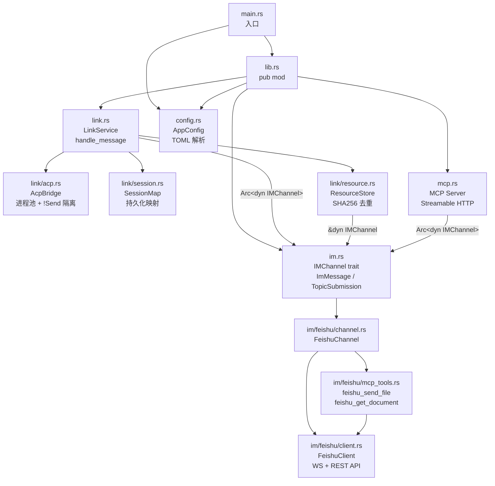
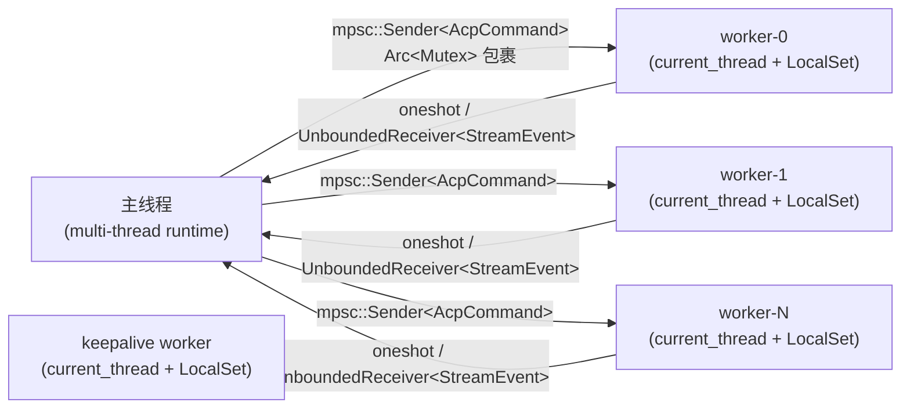

# acp-link 系统架构设计

## 1. 概述

acp-link 是一个 IM ↔ ACP（Agent Client Protocol）桥接服务。它通过 `IMChannel` trait 抽象层接收 IM 平台消息，通过 ACP 协议转发给本地运行的 kiro-cli agent，将 agent 的流式响应以富文本消息形式实时回复到 IM。同时内嵌一个 MCP Server，允许 agent 通过 MCP 协议反向调用 IM 平台能力（如发送文件、获取云文档内容）。

当前支持飞书（Feishu）平台，架构设计支持扩展到钉钉、Slack 等其他 IM 平台。

```
IM 用户  ──── IMChannel ────  acp-link  ──── ACP(stdio) ────  kiro-cli
                                │                                 │
                                └── MCP HTTP Server ◄─────────────┘
```

---

## 2. 模块划分

| 模块       | 文件                                  | 职责                                                                                                                                                                             |
| ---------- | ------------------------------------- | -------------------------------------------------------------------------------------------------------------------------------------------------------------------------------- |
| 入口       | `main.rs`                             | 加载配置 → 初始化日志 → 根据 `im_platform` 创建 `Arc<dyn IMChannel>` → 启动 `LinkService`                                                                                        |
| 库根       | `lib.rs`                              | 重新导出 `config`、`im`、`link`、`mcp` 四个公开模块                                                                                                                              |
| IM 抽象层  | `im.rs` + `im/feishu/channel.rs`      | `IMChannel` trait 定义、跨平台统一消息类型（`ImMessage`、`ImMessageContent`、`TopicSubmission` 等）；`FeishuChannel` 实现飞书平台适配                                            |
| 飞书客户端 | `im/feishu/client.rs`（`pub(crate)`） | WS 长连接、protobuf 帧解析、消息分片重组、消息去重、token 缓存、REST API（回复/更新消息、上传/发送文件、下载资源、拉取 thread、获取云文档、解析 wiki 节点）                      |
| 飞书 MCP   | `im/feishu/mcp_tools.rs`              | 飞书平台 MCP Tool 定义与分发（`feishu_send_file`、`feishu_get_document`）                                                                                                        |
| ACP 桥接   | `link/acp.rs`                         | kiro-cli 子进程池、`!Send` runtime 隔离（`current_thread` + `LocalSet`）、FNV-1a 稳定 hash 路由、流式 chunk 转发、权限自动批准、worker 崩溃自动重启、keepalive 心跳（每 6 小时） |
| 核心服务   | `link.rs`                             | 消息分发（每消息独立 task）、session 生命周期管理（全量/增量模式）、content block 构建、消息流式更新节流（300ms）、定时清理、优雅关机                                            |
| 会话映射   | `link/session.rs`                     | `topic_id ↔ session_id` 双向映射、`message_id → topic_id` 反向索引、JSON 原子持久化（tmp + rename）、按配置天数过期清理                                                          |
| 资源存储   | `link/resource.rs`                    | 通过 `IMChannel` trait 下载资源、SHA256 去重落盘、mtime 刷新防误删、`file://` URI 生成、按配置天数过期清理                                                                       |
| 配置管理   | `config.rs`                           | TOML 解析、`im_platform` 平台选择、优先级查找（环境变量 > 当前目录 > `~/.acp-link/`）、自动生成默认配置模板、目录自动创建                                                        |
| MCP Server | `mcp.rs`                              | 内嵌 HTTP Server（axum，Streamable HTTP transport），JSON-RPC 2.0 协议，通过 `IMChannel` trait 调用 IM 平台能力，供 agent 反向调用                                               |

---

## 3. 模块依赖图



---

## 4. 端到端数据流

```mermaid
sequenceDiagram
    participant U as IM 用户
    participant C as IMChannel (FeishuChannel)
    participant L as LinkService
    participant S as SessionMap
    participant R as ResourceStore
    participant A as AcpBridge
    participant K as kiro-cli
    participant M as MCP Server

    U->>C: 发送消息（文本/图片/文件/链接）
    C->>C: 平台协议处理（protobuf 解帧 + 3s ACK）
    C->>C: 消息去重（30min 窗口）
    C-->>L: ImMessage (mpsc channel, cap=32)

    L->>L: tokio::spawn(handle_message)
    L->>C: reply_message("...") → 创建占位卡片消息
    C-->>L: (reply_msg_id, topic_id)
    L->>S: map_topic(message_id, topic_id)

    alt 已有 session（增量模式）
        L->>S: get_session_id(topic_id)
        S-->>L: session_id
        alt session 未在 worker 中加载
            L->>A: load_session(topic_id, session_id, cwd)
            L->>L: loaded_sessions.insert(session_id)
        end
        L->>L: 构建 [im_context + 当前文本] blocks
    else 新 session（全量模式）
        L->>C: aggregate_topic(topic_id) → 拉取全量消息
        L->>C: download_resource() → 下载图片（base64 内嵌）
        L->>R: save_resource() → 下载文件（SHA256 落盘）
        L->>L: 构建 [im_context + texts + images + resource_links] blocks
        L->>A: new_session(topic_id, cwd)
        A-->>L: new session_id
        L->>S: insert(topic_id, session_id)
    end

    L->>A: prompt_stream(topic_id, session_id, blocks)
    A->>K: ACP Prompt 请求 (stdio)
    A-->>L: UnboundedReceiver&lt;StreamEvent&gt;（立即返回）

    loop 流式 chunk 消费
        K-->>A: AgentMessageChunk / ToolCall
        A-->>L: StreamEvent::Text / StreamEvent::ToolCall
        alt 距上次更新 ≥ 300ms 且无 inflight 更新
            L->>C: update_message(reply_msg_id, full_text)
            C->>U: 消息实时更新
        end
    end

    L->>C: update_message(reply_msg_id, final_text)
    C->>U: 最终完整响应

    opt agent 需要发送文件 / 获取云文档
        K->>M: MCP tools/call (feishu_send_file / feishu_get_document)
        M->>C: upload + send_reply / get_document_raw_content
        C->>U: 图片/文件消息
        M-->>K: 执行结果
    end
```

---

## 5. 消息处理流程

### 5.1 消息分发逻辑

`handle_message` 根据消息的 `topic_id` 和内容类型决定处理路径：

```mermaid
flowchart TD
    A[收到 ImMessage] --> B{topic_id 存在?}
    B -->|否| C[reply_message 创建话题]
    C --> D{is_actionable?<br/>纯文本消息}
    D -->|是| E[stream_acp_reply<br/>全量模式]
    D -->|否| F[回复"收到，请继续输入指令"]

    B -->|是| G{topic_index 中<br/>有映射?}
    G -->|否| C
    G -->|是| H{is_actionable?}
    H -->|是| I[submit_to_acp_streaming<br/>增量模式]
    H -->|否| J[回复"收到附件，请回复文字指令"]
```

### 5.2 全量模式 vs 增量模式

| 模式     | 触发条件             | 行为                                                                                                            |
| -------- | -------------------- | --------------------------------------------------------------------------------------------------------------- |
| 全量模式 | topic 无对应 session | 调用 `aggregate_topic` 拉取 thread 全部消息，下载图片（base64 内嵌）和文件（`file://` URI），创建新 ACP session |
| 增量模式 | topic 已有 session   | 仅发送当前文本消息，复用已有 session（首次需 `load_session`，之后跳过）                                         |

### 5.3 流式更新节流

```
chunk 到达:  ─┬──┬──┬──┬──┬──┬──┬──┬──┬──┬──┬── stream end
              │  │  │  │  │  │  │  │  │  │  │  │
消息更新:     ├──────────┤  ├──────────┤  ├──────┤
              300ms       300ms       final update
```

- 首个 chunk 立即触发更新（`last_update` 初始化为"很久以前"）
- 后续 chunk 按 300ms 间隔节流
- 上一次更新未完成时跳过本次（避免并发更新冲突）
- 流结束后执行最终更新，确保完整内容展示

---

## 6. 并发模型

### 6.1 主 runtime（多线程）

`main.rs` 使用 `#[tokio::main]`（默认多线程调度器）。`LinkService` 在此 runtime 内运行：

- **消息接收循环**：单个 `tokio::spawn` 任务调用 `IMChannel::listen()`，持续收消息通过 `mpsc::channel(32)` 送入主循环。WS 断开时自动 5 秒后重连。
- **每消息独立任务**：主循环对每条 `ImMessage` 调用 `tokio::spawn(handle_message(...))`，多条消息可并发处理。
- **定时清理**：`tokio::time::interval(3600s)` 定期清理 session、资源文件、临时目录和历史日志。
- **优雅关机**：监听 `SIGTERM` / `Ctrl+C`，收到信号后 flush session 映射再退出。
- **共享状态**：`Arc<SharedState>` 跨任务共享；`SessionMap` 用 `RwLock` 保护；`loaded_sessions` 缓存已加载的 session 避免重复 `load_session` 调用。
- **MCP Server**：`LinkService::new()` 中以 `tokio::spawn` 启动后台 HTTP 服务（axum）。

### 6.2 ACP worker 线程（单线程）

每个 ACP worker 是一个独立的 OS 线程（`std::thread::spawn`），内部使用：

```
current_thread runtime
  └─ LocalSet
       └─ acp_event_loop（串行处理命令）
            ├─ kiro-cli 子进程（stdio）
            └─ ClientSideConnection（!Send）
```

`!Send` 约束来自 ACP SDK 的 `futures::AsyncRead/Write` trait object 和 `Rc<RefCell>` 内部结构，必须固定在同一线程。详见 [acp-bridge.md](./acp-bridge.md)。

### 6.3 线程间通信



- 命令方向：`AcpCommand` 经 `mpsc::Sender` 发往 worker（sender 包裹在 `Arc<Mutex>` 中，支持崩溃后原子替换）
- 响应方向：`oneshot::Sender` 返回结果；`UnboundedReceiver<StreamEvent>` 流式返回 chunk
- Keepalive worker 使用独立的 kiro-cli 进程（worker_id = `usize::MAX`），不占用业务 worker 队列

---

## 7. 状态持久化

| 数据                     | 文件                              | 格式                           | 过期策略                                              |
| ------------------------ | --------------------------------- | ------------------------------ | ----------------------------------------------------- |
| topic_id ↔ session_id    | `~/.acp-link/sessions.json`       | JSON（原子写入：tmp + rename） | `session_retention` 天（默认 7），启动时 + 每小时清理 |
| 下载的图片/文件          | `~/.acp-link/data/{sha256}.{ext}` | 原始二进制                     | `resource_retention` 天（默认 7，按文件 mtime）       |
| 临时文件（kiro-cli cwd） | `~/.acp-link/temp/`               | 由 kiro-cli 产生               | `resource_retention` 天（默认 7，按文件 mtime）       |
| 滚动日志                 | `~/.acp-link/logs/acp-link.log.*` | tracing 文本                   | `log_retention` 天（默认 7，按文件 mtime）            |

### 资源去重策略

- 下载的资源以 `{sha256}.{ext}` 命名，相同内容只存一份
- 已存在的文件刷新 mtime（`set_times`），防止被过期清理误删
- 文件以 `file://` URI 传递给 agent，agent 按需读取本地文件

---

## 8. 配置结构

```toml
im_platform = "feishu"          # IM 平台选择，当前支持: "feishu"，默认 "feishu"
log_level = "info"              # tracing 过滤级别
log_retention = 7               # 日志保留天数，默认 7
session_retention = 7           # Session 保留天数，默认 7
resource_retention = 7          # 资源文件保留天数，默认 7

[feishu]
app_id     = "cli_xxx"
app_secret = "your_secret"

[kiro]
cmd       = "kiro-cli"
args      = ["acp", "--agent", "lark"]
pool_size = 4                   # worker 线程数，默认 4
# cwd     = "/path/to/project" # Agent 工作目录，默认 ~/.acp-link/temp/

[mcp]
port = 9800                     # MCP HTTP Server 端口，默认 9800
```

`im_platform` 字段决定使用哪个 IM 平台实现。`main.rs` 根据此值 match 创建对应的 `Arc<dyn IMChannel>`。

---

## 9. MCP Server

内嵌的 MCP Server 以 Streamable HTTP transport 运行在 `http://127.0.0.1:{port}/mcp`，实现 JSON-RPC 2.0 协议。

MCP Server 通过 `Arc<dyn IMChannel>` 调用 IM 平台能力，tool 的注册和执行由 `IMChannel::mcp_tool_list()` 和 `IMChannel::mcp_tool_call()` 提供。

### 9.1 HTTP 端点

| 方法   | 路径   | 说明                                                        |
| ------ | ------ | ----------------------------------------------------------- |
| POST   | `/mcp` | JSON-RPC 请求（`initialize` / `tools/list` / `tools/call`） |
| GET    | `/mcp` | SSE（当前不支持，返回 405）                                 |
| DELETE | `/mcp` | 终止 session                                                |

### 9.2 支持的 Tools（飞书平台）

| Tool 名称             | 描述                                                                 | 参数                                                           |
| --------------------- | -------------------------------------------------------------------- | -------------------------------------------------------------- |
| `feishu_send_file`    | 上传并发送文件到飞书会话（图片 inline，其他走附件）                  | `file_path`（必填）、`message_id`（必填）、`file_name`（可选） |
| `feishu_get_document` | 获取飞书云文档纯文本内容（支持 docx URL、wiki URL 或裸 document_id） | `document`（必填）                                             |

### 9.3 Session 管理

- `initialize` 时生成 UUID v4 作为 session ID
- 后续请求需在 `Mcp-Session-Id` header 中携带
- `DELETE /mcp` 终止 session（需匹配 session ID）
- 当前为简单实现，仅支持单 session

---

## 10. 依赖清单

| crate                        | 版本                   | 用途                               |
| ---------------------------- | ---------------------- | ---------------------------------- |
| tokio                        | 1 (full)               | 异步运行时                         |
| tokio-tungstenite            | 0.28 (rustls)          | WS 客户端（飞书长连接）            |
| tokio-util                   | 0.7 (compat)           | futures/tokio AsyncRead/Write 桥接 |
| prost                        | 0.14                   | protobuf 编解码（飞书 WS 帧）      |
| agent-client-protocol        | 0.10.2                 | ACP SDK（`!Send` future）          |
| reqwest                      | 0.13 (json, multipart) | 飞书 REST API（含文件上传）        |
| axum                         | 0.8                    | MCP HTTP Server                    |
| uuid                         | 1 (v4)                 | MCP session ID 生成                |
| serde / serde_json           | 1                      | 序列化 / 反序列化                  |
| toml                         | 0.9                    | 配置文件解析                       |
| sha2                         | 0.10                   | 资源文件去重哈希                   |
| base64                       | 0.22                   | 图片内嵌编码（ACP ContentBlock）   |
| anyhow                       | 1                      | 错误处理                           |
| async-trait                  | 0.1                    | `?Send` async trait                |
| tracing / tracing-subscriber | 0.1 / 0.3              | 结构化日志                         |
| tracing-appender             | 0.2                    | 滚动日志文件                       |
| dirs                         | 6.0                    | 获取用户主目录                     |
| futures / futures-util       | 0.3                    | ACP SDK 所需 AsyncRead/Write trait |
