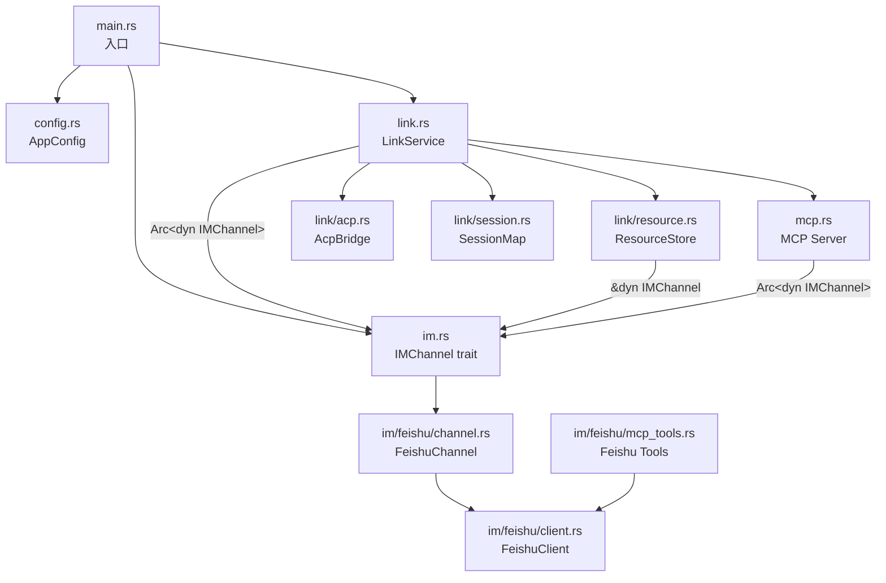
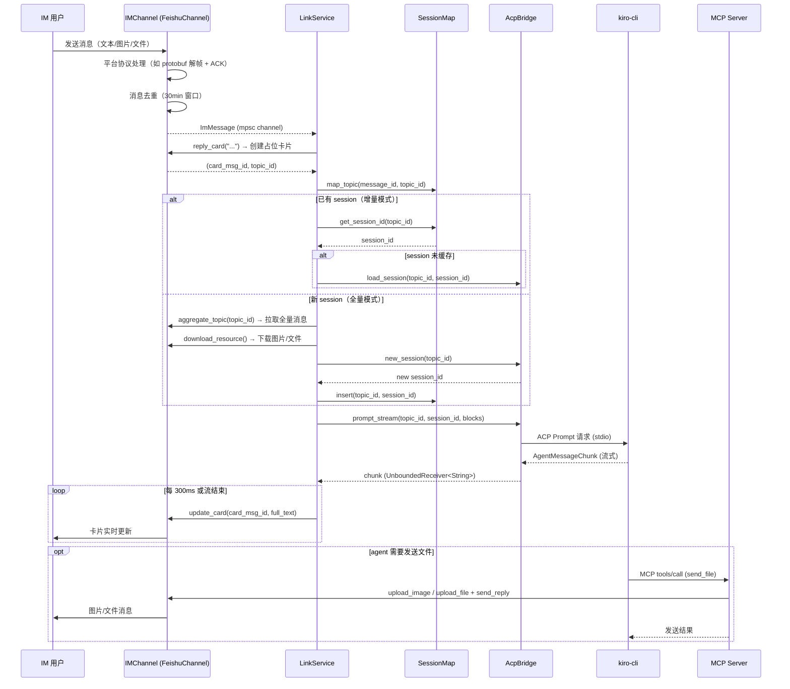
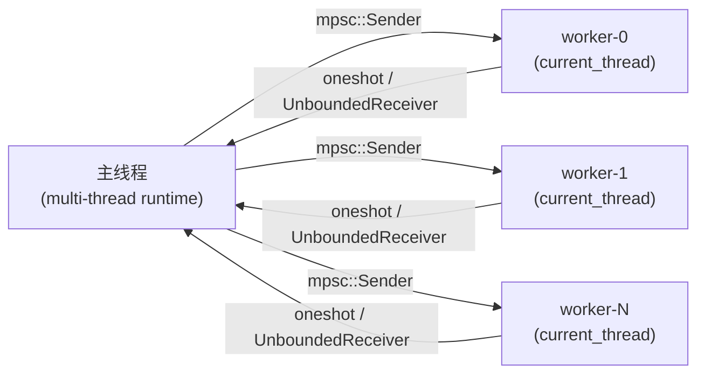

# acp-link 系统架构设计

## 1. 概述

acp-link 是一个 IM ↔ ACP（Agent Client Protocol）桥接服务。它通过 `IMChannel` trait 抽象层接收 IM 平台消息，通过 ACP 协议转发给本地运行的 kiro-cli agent，将 agent 的流式响应以消息卡片形式实时回复到 IM。同时内嵌一个 MCP Server，允许 agent 通过 MCP 协议反向调用 IM 平台能力（如发送文件）。

当前支持飞书（Feishu）平台，架构设计支持扩展到钉钉、Slack 等其他 IM 平台。

```
IM 用户  ──── IMChannel ────  acp-link  ──── ACP(stdio) ────  kiro-cli
                                │                                 │
                                └── MCP HTTP Server ◄─────────────┘
```

---

## 2. 模块划分

| 模块       | 文件                                  | 职责                                                                                                                                            |
| ---------- | ------------------------------------- | ----------------------------------------------------------------------------------------------------------------------------------------------- |
| IM 抽象层  | `im.rs` + `im/feishu/channel.rs`      | `IMChannel` trait 定义、跨平台统一消息类型（`ImMessage`、`TopicSubmission` 等）；`FeishuChannel` 实现飞书平台适配                               |
| 飞书客户端 | `im/feishu/client.rs`（`pub(crate)`） | WS 长连接、protobuf 帧解析、消息去重、token 缓存、REST API（回复/更新卡片、上传/发送文件、下载资源、拉取 thread）                               |
| 飞书 MCP   | `im/feishu/mcp_tools.rs`              | 飞书平台 MCP Tool 定义（如 `feishu_send_file`）                                                                                                 |
| ACP 桥接   | `link/acp.rs`                         | kiro-cli 子进程池、`!Send` runtime 隔离、FNV-1a 稳定 hash 路由、流式 chunk 转发、权限自动批准、worker 崩溃自动重启、keepalive 心跳（每 6 小时） |
| 核心服务   | `link.rs`                             | 消息分发、session 生命周期管理、content block 构建、卡片流式更新节流（300ms）、优雅关机                                                         |
| 会话映射   | `link/session.rs`                     | topic_id ↔ session_id 双向映射、message_id → topic_id 反向索引、JSON 原子持久化（tmp+rename）、按配置天数过期清理（默认 7 天）                  |
| 资源存储   | `link/resource.rs`                    | 通过 `IMChannel` trait 下载资源、SHA256 去重落盘、`file://` URI、按配置天数过期清理（默认 7 天）                                                |
| 配置管理   | `config.rs`                           | TOML 解析、`im_platform` 平台选择、优先级查找（环境变量 > 当前目录 > `~/.acp-link/`）、自动生成默认配置                                         |
| MCP Server | `mcp.rs`                              | 内嵌 HTTP Server（Streamable HTTP transport），通过 `IMChannel` trait 调用 IM 平台能力（如 `feishu_send_file`），供 agent 反向调用              |

---

## 3. 模块依赖图



---

## 4. 端到端数据流



---

## 5. 并发模型

### 5.1 主 runtime（多线程）

`main.rs` 使用 `#[tokio::main]`（默认多线程调度器）。`LinkService` 在此 runtime 内运行：

- **消息接收循环**：单个 `tokio::spawn` 任务调用 `IMChannel::listen()`，持续收消息通过 `mpsc::channel(32)` 送入主循环。
- **每消息独立任务**：主循环对每条 `ImMessage` 调用 `tokio::spawn(handle_message(...))`，多条消息可并发处理。
- **定时清理**：`tokio::time::interval(3600s)` 定期清理 session、资源文件和临时目录。
- **优雅关机**：监听 `SIGTERM` / `Ctrl+C`，收到信号后 flush session 映射再退出。
- **共享状态**：`Arc<SharedState>` 跨任务共享（含 `Arc<dyn IMChannel>`）；`SessionMap` 用 `RwLock` 保护，`loaded_sessions` 缓存已加载的 session 避免重复 `load_session` 调用。
- **MCP Server**：`LinkService::new()` 中以 `tokio::spawn` 启动后台 HTTP 服务（axum）。
- **Keepalive**：`AcpBridge::start()` 启动独立的 keepalive worker（worker ID = `usize::MAX`），每 6 小时创建临时 session 并发送轻量 prompt，防止认证 token 过期。worker 崩溃时自动重启（最多 3 次带退避重试）。

### 5.2 ACP worker 线程（单线程）

每个 ACP worker 是一个独立的 OS 线程（`std::thread::spawn`），内部使用：

```
current_thread runtime
  └─ LocalSet
       └─ acp_event_loop（串行处理命令）
            ├─ kiro-cli 子进程（stdio）
            └─ ClientSideConnection（!Send）
```

`!Send` 约束来自 ACP SDK 的 `futures::AsyncRead/Write` trait object，必须固定在同一线程。详见 [acp-bridge.md](./acp-bridge.md)。

### 5.3 线程间通信



命令方向：`AcpCommand` 经 `mpsc::Sender` 发往 worker（sender 包裹在 `Arc<Mutex>` 中，支持崩溃后替换）。
响应方向：`oneshot::Sender` 返回结果；`UnboundedReceiver<String>` 流式返回 chunk。

---

## 6. 状态持久化

| 数据                     | 文件                              | 格式                           | 过期策略                                              |
| ------------------------ | --------------------------------- | ------------------------------ | ----------------------------------------------------- |
| topic_id ↔ session_id    | `~/.acp-link/sessions.json`       | JSON（原子写入：tmp + rename） | `session_retention` 天（默认 7），启动时 + 每小时清理 |
| 下载的图片/文件          | `~/.acp-link/data/{sha256}.{ext}` | 原始二进制                     | `resource_retention` 天（默认 7，按文件 mtime）       |
| 临时文件（kiro-cli cwd） | `~/.acp-link/temp/`               | 由 kiro-cli 产生               | `resource_retention` 天（默认 7，按文件 mtime）       |
| 滚动日志                 | `~/.acp-link/logs/acp-link.log.*` | tracing 文本                   | 按 `log_retention` 配置清理（默认 7 天）              |

---

## 7. 配置结构

```toml
im_platform = "feishu"          # IM 平台选择，当前支持: "feishu"，默认 "feishu"
log_level = "info"              # tracing 过滤级别
log_retention = 7               # 日志保留天数，默认 7
session_retention = 7           # Session 保留天数，默认 7
resource_retention = 7          # 资源文件保留天数，默认 7

[feishu]
app_id     = "cli_xxx"
app_secret = "your_secret"

[kiro]
cmd       = "kiro-cli"
args      = ["acp", "--agent", "lark"]
pool_size = 4                   # worker 线程数，默认 4

[mcp]
port = 9800                     # MCP HTTP Server 端口，默认 9800
```

`im_platform` 字段决定使用哪个 IM 平台实现。`main.rs` 根据此值 match 创建对应的 `Arc<dyn IMChannel>`。

配置查找优先级：

1. 环境变量 `ACP_LINK_CONFIG` 指定的路径
2. 当前目录 `./config.toml`
3. `~/.acp-link/config.toml`（不存在时自动生成模板）

---

## 8. MCP Server

内嵌的 MCP Server 以 Streamable HTTP transport 运行在 `http://127.0.0.1:{port}/mcp`，实现 JSON-RPC 2.0 协议。

MCP Server 通过 `Arc<dyn IMChannel>` 调用 IM 平台能力，tool 的注册和执行由 `IMChannel::mcp_tool_list()` 和 `IMChannel::mcp_tool_call()` 提供。

### 8.1 支持的 Tools（飞书平台）

| Tool 名称          | 描述                     | 参数                                                           |
| ------------------ | ------------------------ | -------------------------------------------------------------- |
| `feishu_send_file` | 上传并发送文件到飞书会话 | `file_path`（必填）、`message_id`（必填）、`file_name`（可选） |

图片文件（.png/.jpg/.gif/.webp/.bmp）以 inline image 方式发送，其他文件以附件方式发送。

### 8.2 Session 管理

- `POST /mcp` — JSON-RPC 请求（initialize / tools/list / tools/call）
- `GET /mcp` — SSE（当前不支持，返回 405）
- `DELETE /mcp` — 终止 session

`initialize` 时生成 UUID v4 作为 session ID，后续请求需在 `Mcp-Session-Id` header 中携带。

---

## 9. 依赖清单

| crate                        | 版本                   | 用途                               |
| ---------------------------- | ---------------------- | ---------------------------------- |
| tokio                        | 1 (full)               | 异步运行时                         |
| tokio-tungstenite            | 0.28 (rustls)          | WS 客户端                          |
| tokio-util                   | 0.7 (compat)           | futures/tokio AsyncRead 桥接       |
| prost                        | 0.14                   | protobuf 编解码                    |
| agent-client-protocol        | 0.10.2                 | ACP SDK                            |
| reqwest                      | 0.13 (json, multipart) | 飞书 REST API（含文件上传）        |
| axum                         | 0.8                    | MCP HTTP Server                    |
| uuid                         | 1 (v4)                 | MCP session ID 生成                |
| serde / serde_json           | 1                      | 序列化                             |
| toml                         | 0.9                    | 配置解析                           |
| sha2                         | 0.10                   | 文件去重哈希                       |
| anyhow                       | 1                      | 错误处理                           |
| tracing / tracing-subscriber | 0.1 / 0.3              | 结构化日志                         |
| tracing-appender             | 0.2                    | 滚动日志文件                       |
| base64                       | 0.22                   | 图片内嵌编码                       |
| async-trait                  | 0.1                    | `?Send` async trait                |
| dirs                         | 6.0                    | 获取用户主目录                     |
| futures / futures-util       | 0.3                    | ACP SDK 所需 AsyncRead/Write trait |
