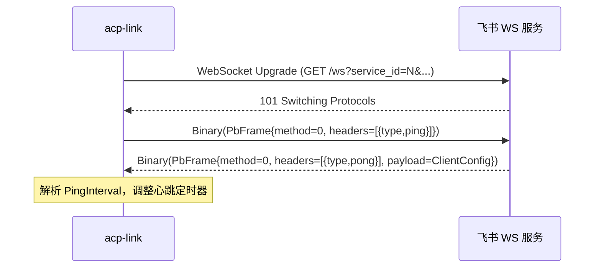
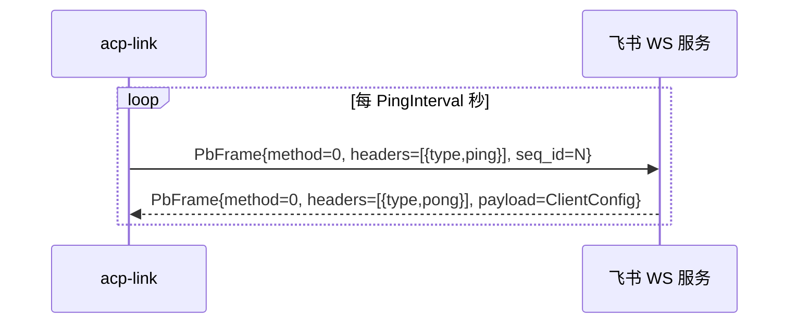
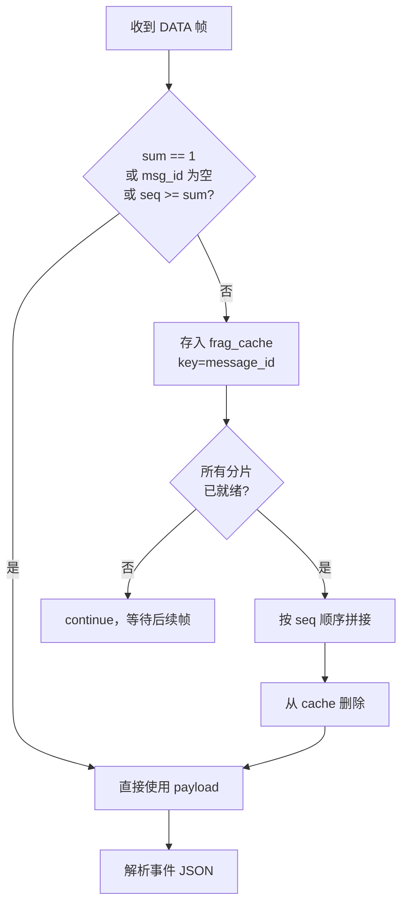

# 飞书 WS 协议细节

## 1. 概述

飞书企业自建应用可选择 WebSocket 长连接模式接收事件推送，替代传统的 HTTP 回调（Webhook）。该协议在标准 WebSocket 的 Binary 帧之上，使用 **protobuf** 自定义了一套帧格式，并要求客户端在 3 秒内对每帧进行 ACK 应答。

连接端点动态获取，每次启动需先通过 REST API 申请：

```
POST https://open.feishu.cn/callback/ws/endpoint
Body: { "AppID": "...", "AppSecret": "..." }
```

响应中包含 `URL`（WSS 地址，含 `service_id` 参数）和 `ClientConfig`（初始心跳间隔等）。

---

## 2. protobuf 帧结构

所有 WS Binary 帧均为 `PbFrame` 编码：

```protobuf
message PbHeader {
    string key   = 1;
    string value = 2;
}

message PbFrame {
    uint64              seq_id   = 1;  // 帧序号（客户端维护，单调递增）
    uint64              log_id   = 2;  // 日志 ID（服务端填充）
    int32               service  = 3;  // service_id（来自 WS URL 查询参数）
    int32               method   = 4;  // 0=CONTROL, 1=DATA
    repeated PbHeader   headers  = 5;  // key-value 元数据
    optional bytes      payload  = 8;  // 业务 payload（JSON）
}
```

`method` 字段将帧分为两大类：

| method | 类型 | 说明 |
|--------|------|------|
| 0 | CONTROL | 心跳（ping/pong） |
| 1 | DATA | 事件数据 |

---

## 3. 连接建立与初始 ping

WS 握手完成后，客户端立即发送一个 CONTROL ping 帧，触发服务端返回 pong（含 `ClientConfig`）：



`ClientConfig` 为 JSON 格式：

```json
{ "PingInterval": 120 }
```

客户端据此动态调整心跳间隔（最小 10 秒）。

---

## 4. 心跳机制



心跳超时检测（`timeout_check` 每 10 秒运行）：若超过 300 秒未收到任何有效帧（Binary / Ping / Pong），则断开重连。

重连策略由外层 `loop` 控制：

```rust
loop {
    if let Err(e) = client.listen(tx.clone()).await {
        tracing::error!("WS error: {e}, reconnecting...");
        tokio::time::sleep(Duration::from_secs(5)).await;
    }
}
```

---

## 5. ACK 机制

飞书要求客户端在 **3 秒内** 对每个 DATA 帧回送 ACK，格式为将原始帧的 payload 替换，并追加 `biz_rt` header：

```rust
let mut ack = frame.clone();                          // 保留原 seq_id / service / headers
ack.payload = Some(br#"{"code":200,"headers":{},"data":[]}"#.to_vec());
ack.headers.push(PbHeader { key: "biz_rt".into(), value: "0".into() });
write.send(WsMsg::Binary(ack.encode_to_vec().into())).await;
```

ACK 在收到帧后**同步发送**（事件处理之前），保证不超时。

---

## 6. 消息分片（Fragmentation）

单条事件可能被拆分为多个 DATA 帧传输，通过以下 header 字段标识：

| Header key | 含义 |
|------------|------|
| `message_id` | 分片所属消息的唯一 ID |
| `sum` | 总分片数（0 或 1 表示不分片） |
| `seq` | 当前分片序号（0-based） |

重组逻辑：



`frag_cache` 会在每次心跳 tick 时清理超过 300 秒的残留条目，防止内存泄漏。

---

## 7. 事件处理流程

收到完整 payload 后：

1. 解析顶层 `FeishuEvent`，检查 `header.event_type == "im.message.receive_v1"`，其他类型直接跳过。
2. 过滤 bot/app 发送的消息（`sender_type == "app" || "bot"`）。
3. 群聊消息须包含 `@机器人`（mention 中存在 `user_id` 为 `None` 的条目）。
4. **消息去重**：30 分钟窗口内相同 `message_id` 只处理一次（WS 重连后服务端可能重推）。
5. 按 `message_type` 解析消息内容（text / image / file / audio / media / sticker）。
6. 构造 `FeishuMessage` 发往 `mpsc::Sender<FeishuMessage>`。

---

## 8. 消息类型与 content 格式

| message_type | content JSON 结构 |
|-------------|-------------------|
| `text` | `{"text": "消息内容"}` |
| `image` | `{"image_key": "img_xxx"}` |
| `file` | `{"file_key": "...", "file_name": "...", "file_size": N}` |
| `audio` | `{"file_key": "...", "duration": N}` |
| `media` | `{"file_key": "...", "file_name": "...", "duration": N, "width": W, "height": H}` |
| `sticker` | `{"file_key": "...", "file_type": "..."}` |

群聊 text 消息中，`@机器人` 会被注入 `@_user_N` 占位符（N 为数字），`strip_at_placeholders()` 负责清除。

---

## 9. REST API

除 WS 之外，飞书 REST API 用于以下操作：

| 操作 | 方法 | 端点 |
|------|------|------|
| 获取 tenant_access_token | POST | `/auth/v3/tenant_access_token/internal` |
| 获取 WS endpoint | POST | `/callback/ws/endpoint` |
| 回复消息（创建卡片） | POST | `/im/v1/messages/{message_id}/reply` |
| 更新卡片内容 | PATCH | `/im/v1/messages/{message_id}` |
| 下载资源文件 | GET | `/im/v1/messages/{message_id}/resources/{file_key}?type={type}` |
| 拉取 thread 消息列表 | GET | `/im/v1/messages?container_id_type=thread&container_id={thread_id}&page_size=50` |
| 上传图片 | POST | `/im/v1/images` (multipart/form-data) |
| 上传文件 | POST | `/im/v1/files` (multipart/form-data) |
| 发送图片回复 | POST | `/im/v1/messages/{message_id}/reply` (msg_type=image) |
| 发送文件回复 | POST | `/im/v1/messages/{message_id}/reply` (msg_type=file) |

### Token 缓存策略

`tenant_access_token` 有效期通常为 7200 秒，缓存后在到期前 120 秒（`TOKEN_REFRESH_SKEW`）主动刷新，避免中间件层面出现 401。并发请求采用 double-check 模式：先读锁检查缓存，未命中时获取写锁并再次检查，确保同一时刻只有一个任务执行实际的 token 刷新请求。

```
Token 有效期: |-------- 7200s --------|
刷新窗口:     |--- 7080s ---|[120s]
                             ^── 下次请求时触发刷新
```

---

## 10. 消息卡片格式

回复和更新均使用飞书交互式卡片（`msg_type: "interactive"`），卡片体结构：

```json
{
  "elements": [
    {
      "tag": "markdown",
      "content": "<markdown 文本>"
    }
  ]
}
```

回复时设置 `reply_in_thread: true` 以在 Thread 内创建话题，响应中含 `data.thread_id`，作为后续 session 路由的 key。

---

## 11. Thread 聚合

`aggregate_thread` 拉取 thread 内所有消息，按消息类型分类汇总：

- **文本消息**：合并为 `texts` 列表
- **图片消息**：收集 `(message_id, image_key)` 列表，由调用方按需下载
- **文件消息**：收集 `(message_id, file_key, file_name)` 列表，由调用方按需下载

此聚合用于新 session 的全量模式，确保 agent 获得完整的对话上下文。
